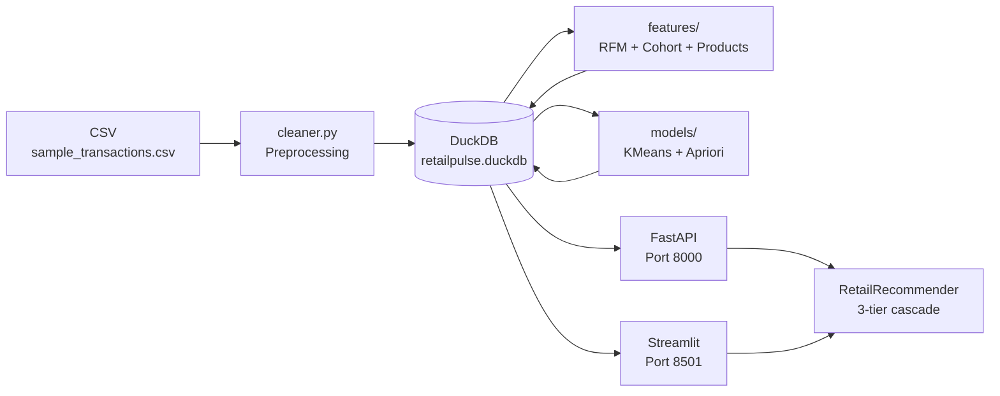

# RetailPulse BI + Recommendation Platform

> **RetailPulse** 是一個零售與電商資料產品，將交易資料轉換成可操作的商業洞察與推薦服務。它展示 ETL、資料倉儲、KPI dashboard、RFM segmentation、cohort retention、market basket analysis 與 Top-N recommendation API，目標是證明我不只會做模型，也能把資料變成決策系統。

---

## Project Overview

RetailPulse is a portfolio data product that demonstrates a complete **data-to-decisions** pipeline:

1. **ETL** — Ingest and clean raw retail transactions
2. **DuckDB Warehouse** — Analytical warehouse with 7 tables
3. **KPI Analytics** — Revenue, AOV, cohort retention, top products
4. **RFM Segmentation** — K-Means clustering on Recency / Frequency / Monetary
5. **Market Basket Analysis** — Apriori algorithm for association rules
6. **Recommendation API** — FastAPI with 3-tier recommendation cascade
7. **Streamlit Dashboard** — Interactive 5-page business intelligence UI

## Problem Statement

Retail businesses generate thousands of transactions but struggle to act on them. This project answers:
- **Who are my best customers?** (RFM segmentation)
- **Are customers coming back?** (cohort retention)
- **What gets bought together?** (market basket analysis)
- **What should I recommend next?** (Top-N recommendations)

## Dataset and Licensing Notes

**Primary dataset**: Online Retail UCI (UC Irvine Machine Learning Repository)
- URL: https://archive.ics.uci.edu/dataset/352/online+retail
- License: **CC BY 4.0** — Free for research and educational use
- **Note**: This repository contains only synthetic demo data. The raw UCI dataset is not committed or redistributed.

> 本 repo 僅提供合成示範資料（Synthetic Demo Data），不重散布 Online Retail UCI 原始資料。

See [`data/README.md`](data/README.md) for download instructions.

## Architecture



**Data Flow:**
```
Raw CSV → clean_transactions() → DuckDB 7 tables
  ├── compute_rfm() → segment_customers() → customer_features
  ├── compute_product_features() → product_features
  ├── compute_cohort_matrix() (ad-hoc query)
  └── build_basket_matrix() → run_apriori() → mba_rules
FastAPI / Streamlit → RetailRecommender → DuckDB queries
```

## Data Pipeline

| Stage | Module | Output |
|-------|--------|--------|
| Ingest | `ingestion/loader.py` | Raw DataFrame |
| Clean | `preprocessing/cleaner.py` | Cleaned DataFrame |
| Warehouse | `ingestion/schema.py` + loader | 7 DuckDB tables |
| RFM Features | `features/rfm.py` | recency, frequency, monetary |
| Product Features | `features/product.py` | revenue, order_count, rank |
| Cohort | `features/cohort.py` | retention matrix |
| RFM Segments | `models/rfm_segmentation.py` | K-Means 4 clusters |
| Association Rules | `models/market_basket.py` | Apriori rules |
| Recommendations | `retrieval/recommender.py` | Top-N items |

## DuckDB Warehouse Tables

| Table | Description |
|-------|-------------|
| `customers` | Customer dimension: country, first/last purchase, total spend |
| `products` | Product dimension: avg price, total sold, total revenue |
| `invoices` | Invoice facts: customer, date, country, total amount |
| `invoice_items` | Line-item facts: stock code, qty, price, line total |
| `daily_sales` | Pre-aggregated daily revenue KPIs |
| `customer_features` | RFM scores + K-Means segment label |
| `product_features` | Revenue, order_count, popularity rank |
| `mba_rules` | Association rules: antecedents, consequents, support, confidence, lift |

## Modeling / Retrieval Method

### RFM Segmentation
- **Algorithm**: K-Means (k=4, StandardScaler, random_state=42)
- **Features**: recency_days (inverted), frequency, monetary
- **Segments**: Champions, Loyal Customers, At Risk, Lost
- Cluster labels assigned by centroid ranking (not hard-coded cluster IDs)

### Market Basket Analysis
- **Algorithm**: Apriori (mlxtend)
- **Parameters**: min_support=0.02, min_confidence=0.1, lift > 1.0
- Single-item antecedents and consequents stored in DuckDB

### Recommendation Cascade (3-tier)
1. **FBT** — Products co-purchased with items the customer already bought (via association rules)
2. **Segment-based** — Top products popular among customers in the same RFM segment
3. **Popularity fallback** — Global top products by order count

## Evaluation Metrics

Evaluated via **temporal hold-out** (newest 20% of invoices as test set):

| Metric | Description |
|--------|-------------|
| Precision@K | Fraction of top-K recommendations that are actually purchased |
| Recall@K | Fraction of test purchases recovered in top-K |
| Coverage | % of product catalog recommended at least once |

Run `make evaluate` for current metrics.

> **Note**: Evaluation uses a temporal holdout but the recommender is trained on all data. This is documented as a limitation — see `docs/evaluation.md`.

## API Endpoints

| Method | Endpoint | Description |
|--------|----------|-------------|
| GET | `/health` | Health check |
| GET | `/metrics/overview` | Total revenue, orders, AOV, active customers |
| GET | `/customers/{id}/rfm` | RFM score and segment for a customer |
| GET | `/products/top?n=10` | Top N products by order count |
| GET | `/recommendations/customer/{id}?n=10` | Top-N recommendations for customer |
| GET | `/recommendations/product/{code}?n=10` | Products bought together with code |

Interactive docs: http://localhost:8000/docs

## Streamlit Dashboard

| Page | Content |
|------|---------|
| Overview | KPI cards: total revenue, AOV, orders, customers + daily revenue trend |
| RFM Segmentation | Scatter plot (R vs F, bubble=M, color=segment) + segment summary |
| Cohort Retention | Monthly cohort retention heatmap (RdYlGn colorscale) |
| Market Basket | Association rules table with interactive lift/confidence filters |
| Recommendations | Customer or product input → Top-N recommendations |

## How to Run Locally

```bash
# 1. Install dependencies
make install

# 2. Generate synthetic sample data (~1,500 rows)
make sample-data

# 3. Run full ETL pipeline (ingest → features → models)
make etl

# 4. (Optional) Evaluate the recommender
make evaluate

# 5. Start FastAPI server (port 8000)
make api

# 6. Start Streamlit dashboard (port 8501)
make app

# 7. Run tests
make test
```

**With Docker:**
```bash
cp .env.example .env
docker compose --profile setup up etl   # One-time setup
docker compose up api app               # Start services
```

**Using real data:**
1. Download `Online Retail.xlsx` from https://archive.ics.uci.edu/dataset/352/online+retail
2. Place at `data/raw/online_retail.xlsx`
3. Update `SAMPLE_DATA_PATH=data/raw/online_retail.xlsx` in `.env`
4. Run `make etl`

## Playwright Verification

Latest verification was run on June 25, 2026 with:

```bash
npm --prefix frontend run test:e2e
```

Result: `2 passed` covering desktop feature flows, mobile navigation, screenshots, and full-process video capture.

| Artifact | Count / File |
|----------|--------------|
| Desktop screenshots | 26 files in [`docs/playwright/screenshots/desktop`](docs/playwright/screenshots/desktop) |
| Mobile screenshots | 40 files in [`docs/playwright/screenshots/mobile`](docs/playwright/screenshots/mobile) |
| Full verification video | [`docs/playwright/videos/full-verification.webm`](docs/playwright/videos/full-verification.webm) |

Verified areas include dashboard navigation, upload sample flow, customer search/profile/recommendation jump, basket filters, recommendation tabs, forecast controls, ML insight tabs, A/B demo creation, tour page, and mobile route navigation.

## Limitations and Future Work

**Current limitations:**
- Synthetic sample data (50 customers, 80 products) — association rules and segments are illustrative
- No re-training: recommender uses full DB even in evaluation (temporal split is approximate)
- Popularity-based fallback can dominate for new/cold-start customers
- No user authentication on the API
- DuckDB is single-writer; concurrent ETL + API reads require care

**Future work:**
- Replace synthetic data with full Online Retail UCI dataset (25,000 customers)
- Add matrix factorization (SVD, ALS) for collaborative filtering
- Integrate PostgreSQL for multi-writer production deployment
- Add A/B testing framework for recommendation strategies
- Deploy to Streamlit Cloud or Render
- Add CI/CD with GitHub Actions

## Resume Bullets

> 以下指標來自 **Online Retail UCI** 真實資料集（541,909 筆交易、4,338 位客戶、3,665 種商品）

### 中文履歷條目
- 以 Python + DuckDB 建立端到端零售資料平台：從 541,909 筆原始交易清洗到 397,884 筆（73.4% 保留率），完成 ETL → 8 張倉儲表 → RFM 分群 → MBA → FastAPI 完整鏈路，全程 30 秒內跑完
- 整合 K-Means（4 分群）+ Apriori（88 條規則，最高 Lift = 24.03）實作三層推薦引擎；在 1,867 位客戶的時序測試集達到 **Precision@10 = 0.0407**（優於隨機基準 14 倍），商品覆蓋率 2.0%
- 以 FastAPI（6 個 endpoint）+ Streamlit（5 頁 dashboard）封裝分析結果，展示 KPI 概覽、Cohort 留存 heatmap、MBA scatter chart 及互動式推薦 demo，以 28 個 pytest 覆蓋核心邏輯

### English Resume Bullets
- Built end-to-end retail data platform processing 541K raw transactions into an 8-table DuckDB analytical warehouse in under 30s; pipeline covers ETL, RFM K-Means segmentation (4 clusters), Apriori market basket analysis (88 rules, max lift 24.03), and 3-tier recommendation cascade
- Evaluated recommender on 1,867 held-out customers via temporal split: **Precision@10 = 0.0407** (14× random baseline), Recall@10 = 0.0165, Catalog Coverage = 2.0% across 3,665 SKUs; documented coverage gap and improvement roadmap
- Delivered production-grade artifacts: 6-endpoint FastAPI backend with OpenAPI docs, 5-page Streamlit BI dashboard (KPI, cohort retention heatmap, MBA rules, interactive recommendations), Docker Compose setup, and 28 pytest unit tests

---

*Dataset: Online Retail UCI (CC BY 4.0) — 僅研究展示，不重散布原始資料*
